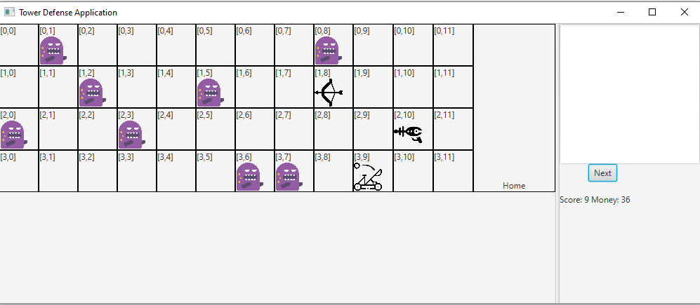

# COMP2026 Programming Assignment 3 - Tower Defense

## 2022-23 Semester 1

* Designed by: [Dr. Kevin Wang](mailto:kevinw@comp.hkbu.edu.hk)
* Q & A: [Piazza](https://piazza.com/)
* Assignment Website: [GitHub](https://github.com/khwang0/COMP2026-2223PA3)
* Due: 
  * UAT Due: 11:59am (Monday noon), TBD
  * Programming Due: 23:59pm (Saturday midnight), TBD 
* Download the demo program: [here](demo.jar)
* Download everything from the assignment: [here](https://github.com/khwang0/COMP2026-2223PA3/archive/refs/heads/master.zip)

> To run the demo program, type the following in your terminal:
> 
> ```sh
> > java -jar demo.jar
> ```

  

# Learning outcome

Students are expected to have some practice on object-oriented programming concept/Inheritance/Polymorphism/List/Exception Handling/visibility in this assignment. We expect most students would spend 5 hours or more to finish the assignment without any assistance. Make sure you start earlier as possible and ask us on Piazza if you have any difficulty!


# Introduction

You are going to implement a game Tower Defense (TD). In this assignment there are quite a few Java files that you need to include in the project. You need to complete the methods stated in the skeleton code. Make sure you can follow the instructions given at the top of each method. The file structure is as below:

| Files | Need to modify | Remarks |
|---|---|---|
| `res/*.png` | No | Graphic for GUI version |
| `Game.java` | Yes | The mastermind of the game |
| `Block.java` | Yes | Model the generic parent of a Tower/Monster |
| `Tower.java` | No | Model the generic parent of different towers |
| `Monster.java` | Yes | Model monsters |
| `ArcheryTower.java` | Yes | Archery Tower |
| `LaserTower.java` | Yes | Laser Tower |
| `CatapultTower.java` | Yes |  Catapult Tower |
| `Displayable.java` | No | The interface for display |
| `ConsoleDisplay.java` | Yes | For handling user I/O and display content on screen | 
| `GUIDisplay.java` | No | For handling user I/O and display content over Graphic User Interface (GUI) |
| `InvalidInputException.java` | Yes | A customer exception class |

A [sample program](demo.jar) is given to you. When there is something you are not sure, you can take a look at the sample program to decide what to do.

Some methods are labeled as completed or given. Please don't make any change on those methods. You are not supposed to modify them.

# Explanation of the game Tower Defense

This is a video game that monster will come out on each round. The monster will get stronger and stronger as times goes by. The player starts with some money that can be used to build towers or upgrade towers. These tower will shoot and kill monsters. However, if one monster can escape from the tower's attack and reach the home sign, the game is over. The objective of the game is to get as much point (number of monster killed) as possible. When a monster steps on a tower, the tower will be crashed. 

Most of the game details can be found at the comment of the java file. Good luck!

# Demo

A sample program can be found here demo. The sample program provides you an understanding of the program. You do not need to follow the exact wording and output format of the program. 

The demo include a GUI version and a command line version (which decided by typing Y or N at the start of the programme). Whenever there is a discrepancy, we follow the command line version.

It is totally OK if your program does not work with the GUI version. We will grade your code based on the command line only.

# Bonus

You are more than welcome to improve the game by creating some interesting monsters and towers. If you wish to attempt the bonus part, please complete the original program first. Then make your bonus part in another project and submit them separately. 

# Understanding the Assignment Test (UAT)

This part is independent to your programming code. You will need to answer the following short questions by **another due date**.
Submit your answers on Moodle. 

1. If an `ArcheryTower` is built at (3, 1) (i.e., row 3, column 1). Will a monster located in the following locations be attacked by this tower (assume there is only one monster).
   1.  (2, 3) 
   2.  (4, 4)
   3.  (5, 2)
2. Determine if the following relationship is correct or not:
   1. A block is a tower.
   2. A tower is a block.
   3. An archeryTower is a LaserTower.
   4. A monster is a tower.
   5. A monster is a block.
   6. A catapult is not a tower.
3. Is it true that a Catapult will attack multiple monsters at a time and all monsters receive the same amount of damage?

---

# Programming Style and Documentation 

Good programming style (indentation, comments) are always essential.  Blank lines, spaces between operators/variables (wherever appropriate) and meaningful variable names are required. Your program should be properly indented.  Good choice of variable names and method names is also essential.  Your program must have proper internal documentation.
Wherever necessary and appropriate, you should add inline comments to explain the execution flow of your program. You are required to remove the word TODO from your program before submission. Fail to do so will yield certain penalty. There are certain constant (final variables) in the program. Use them whenever possible.


# Submission 
Zip your project and submit that to Moodle.  

Please be reminded that both the **Late Penalty Rule** and the **Penalty for Plagiarism** are applied strictly to all submissions of this course (including this assignment).   

### Late Penalty Rule

```java
if (lateHour > 0) {
    if (lateHour < 24) 
        mark *= 0.8;
    else if (lateHour < 48)
        mark = mark >> 1;
        else if (lateHour < 72)
            mark = mark >> 2;
            else
                mark &= 0;
}
```


 ## Plagiarism

 Plagiarism is a serious offense and can be easily detected. Please don't share your code to your classmate even if they are threatening you with your friendship. If they don't have the ability to work on something that can compile, they would not be able to change your code to a state that we can't detect the act of plagiarism. For the first commit of plagiarism, regardless you shared your code or copied code from others, you will receive 0 with an addition of 5 mark penalty. If you commit plagiarism twice, your case will be presented in the exam board and you will receive a F directly.

## Marking Scheme 
This assignment is worth X% of the course mark. There are three elements in the marking scheme:

5% - Understanding the Assignment Test (UAT)
25% - The program can be compiled.
65% - a working program that functions as specified
5% - Programming style and documentation
up to 15% - Bonus - creative design of the assignment. You are qualified for this part only if you have received 85% mark or above. Bonus is given based on the amount of effort (which may not be proportional to the outcome) you have spent on it.

> Important: in this assignment, you are free to use any API including `List`, `ArrayList`...

## Interview 
Should the teaching team see fit, students may be requested to attend an interview to explain about their program.  Students failing to attend such interview or to demonstrate a good understanding of their own program may result in mark deduction. 


